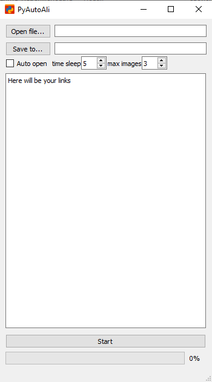

<div id="top"></div>

[![Contributors][contributors-shield]][contributors-url]
[![Forks][forks-shield]][forks-url]
[![Stargazers][stars-shield]][stars-url]
[![Issues][issues-shield]][issues-url]
[![GNU GPLv3 License][license-shield]][license-url]

## About The Project



PyAutoAli - is an automated system to ensure efficient parsing of AliExpress pages

Why:
* Your time should be focused on other things. For example, by searching for new collections of products
* You don't have to do the same tasks over and over again by checking each page yourself
* You are not required to use the terminal

<p align="right">(<a href="#top">back to top</a>)</p>


### Built With

* [Python](https://www.python.org/)
* [PyQt5](https://pypi.org/project/PyQt5/)
* [BeautifulSoup4](https://pypi.org/project/beautifulsoup4/)
* [requests](https://pypi.org/project/requests/)

<p align="right">(<a href="#top">back to top</a>)</p>


<!-- GETTING STARTED -->
## Getting Started

This is an example of how you may give instructions on setting up your project locally.
To get a local copy up and running follow these simple example steps.

### Installation

_Below is an example of how you can instruct your audience on installing and setting up your app. This template doesn't rely on any external dependencies or services._

1. Clone the repo
   ```sh
   git clone https://github.com/gdeMojChay/PyAutoAli.git
   ```
2. Install NPM packages
   ```sh
   pip3 install -r requirements.txt
   ```
3. Enter your settings in `PyAutoAli.py`
   ```py
   self.timesleep: int = 5
   self.maximages: int = 3
   self.parser: str ="html.parser"
   ```

<p align="right">(<a href="#top">back to top</a>)</p>


<!-- USAGE EXAMPLES -->
## Usage

Run the file using the command line PyAutoAli.py or gui.py using one of the commands or run one of the .exe files (in the future)
```sh
   python3 cli.py
   python3 gui.py
   ```

<p align="right">(<a href="#top">back to top</a>)</p>

<!-- CONTRIBUTING -->
## Contributing

Contributions are what make the open source community such an amazing place to learn, inspire, and create. Any contributions you make are **greatly appreciated**.

If you have a suggestion that would make this better, please fork the repo and create a pull request. You can also simply open an issue with the tag "enhancement".
Don't forget to give the project a star! Thanks again!

1. Fork the Project
2. Create your Feature Branch (`git checkout -b feature/AmazingFeature`)
3. Commit your Changes (`git commit -m 'Add some AmazingFeature'`)
4. Push to the Branch (`git push origin feature/AmazingFeature`)
5. Open a Pull Request

<p align="right">(<a href="#top">back to top</a>)</p>


<!-- LICENSE -->
## License

Distributed under the GNU GPLv3 License. See `LICENSE.txt` for more information.

<p align="right">(<a href="#top">back to top</a>)</p>


<!-- CONTACT -->
## Contact

Alex - thetypgame@gmail.com

Project Link: [https://github.com/gdeMojChay/PyAutoAli](https://github.com/gdeMojChay/PyAutoAli)

<p align="right">(<a href="#top">back to top</a>)</p>

[contributors-shield]: https://img.shields.io/github/contributors/gdeMojChay/PyAutoAli.svg?style=for-the-badge
[contributors-url]: https://github.com/gdeMojChay/PyAutoAli/graphs/contributors
[forks-shield]: https://img.shields.io/github/forks/gdeMojChay/PyAutoAli.svg?style=for-the-badge
[forks-url]: https://github.com/gdeMojChay/PyAutoAli/network/members
[stars-shield]: https://img.shields.io/github/stars/gdeMojChay/PyAutoAli.svg?style=for-the-badge
[stars-url]: https://github.com/gdeMojChay/PyAutoAli/stargazers
[issues-shield]: https://img.shields.io/github/issues/gdeMojChay/PyAutoAli.svg?style=for-the-badge
[issues-url]: https://github.com/gdeMojChay/PyAutoAli/issues
[license-shield]: https://img.shields.io/github/license/gdeMojChay/PyAutoAli.svg?style=for-the-badge
[license-url]: https://github.com/gdeMojChay/PyAutoAli/blob/master/LICENSE.txt
